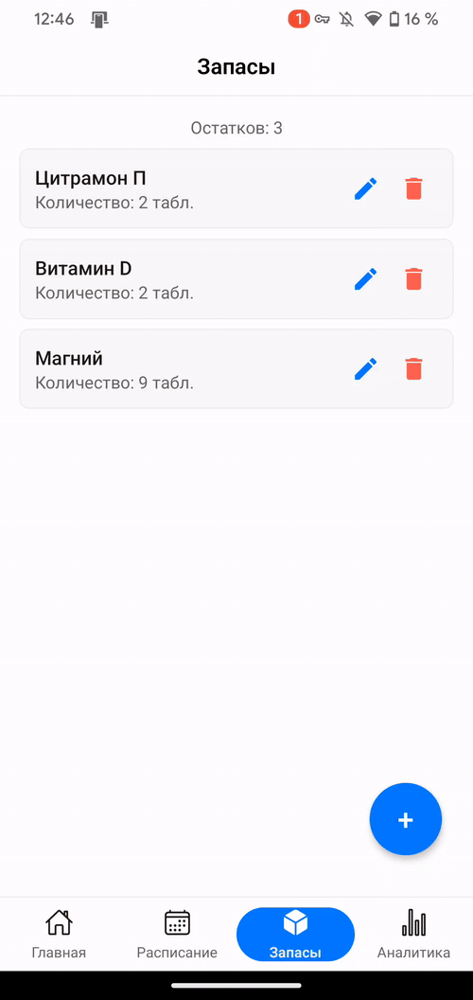

# Medical Schedule Application

### Описание
Данный проект представляет собой фронтенд-часть выпускной квалификационной работы, направленной на обеспечение соблюдения режима приёма лекарственных препаратов. Приложение разработано для упрощения управления графиком приёма медикаментов и контроля их остатков.

### Основные функции
- Создание и управление планами приёма лекарственных препаратов.
- Отправка уведомлений о необходимости приёма препарата.
- Мониторинг остатков препаратов с уведомлениями о необходимости их пополнения.
- Предоставление сводной информации о приёмах.

### Основные экраны приложения

#### Главный экран
Главный экран отображает уведомления о приёмах на ближайшие дни или недели. Также здесь фиксируется выполнение каждого приёма.

  

#### Экран планов
Экран представляет собой календарь, на котором отмечены дни с запланированными приёмами. Пользователь может просматривать историю приёмов, предстоящие приёмы, а также полный список приёмов с возможностью их удаления или продления.  

  

#### Экран остатков
Экран содержит информацию об остатках лекарственных препаратов у пользователя. Предусмотрены функции добавления и редактирования данных об остатках.  

  

### Лицензия
Проект распространяется под лицензией MIT.
